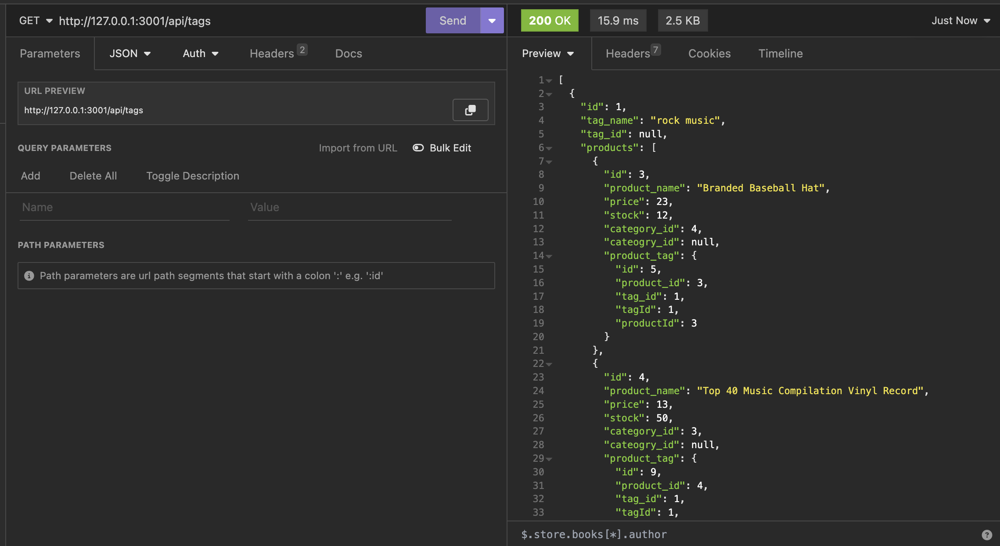

# E-commerce Back End

## Description

### User Story

AS A manager at an internet retail company
I WANT a back end for my e-commerce website that uses the latest technologies
SO THAT my company can compete with other e-commerce companies

### Acceptance Criteria

GIVEN a functional Express.js API
WHEN I add my database name, MySQL username, and MySQL password to an environment variable file
THEN I am able to connect to a database using Sequelize
WHEN I enter schema and seed commands
THEN a development database is created and is seeded with test data
WHEN I enter the command to invoke the application
THEN my server is started and the Sequelize models are synced to the MySQL database
WHEN I open API GET routes in Insomnia Core for categories, products, or tags
THEN the data for each of these routes is displayed in a formatted JSON
WHEN I test API POST, PUT, and DELETE routes in Insomnia Core
THEN I am able to successfully create, update, and delete data in my database

Provide a short description explaining the what, why, and how of your project. Use the following questions as a guide:

The motivation for this project is to create a back endfor an e-commerce website. Through this project I learned more about using express.js to create API routes with get, put, post, and delete routes. For the database I utalized sequelize to interact with my MySQL database.

## Table of Contents

- [Installation](#installation)
- [Usage](#usage)
- [Credits](#credits)
- [License](#license)

## Installation

To use the program you will download the project files to your local machine. You will also want to ensure you have a program to help you with the get, put, post, and delete routes. For my walkthrough video I have used Insomnia.

## Usage

Once you have downloaded the file you will follow these steps:

1. Create the database by running "mysql -u root -p" in the db folder and running the command "source schema.sql"
2. Run your integrated terminal on the root file.
3. Install required packages with the command "npm i"
4. Seed the database by running "npm run seed"
5. Run the server.js file using "npm start"
6. Open Insomnia and navigate to "http://127.0.0.1:3001/"
7. Explore get, put, post, and delete requests using the routes: "/api/products", "/api/categories", "/api/tags"

GitHub Repo: https://github.com/ahgeak/e_commerce_back_end

Walkthrough Video: https://drive.google.com/file/d/1U4NcTNWFdkF3VFD9LC_Wkjby_4IoNxzO/view?usp=sharing 

Screenshot of get request for the Tags api route:

## Credits

I worked on this project alone without other collaborators.

## License

This project uses an MIT license
